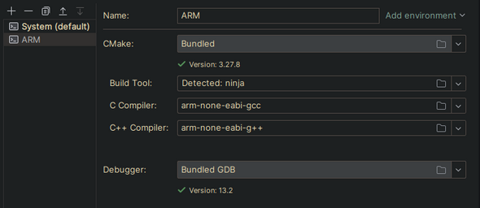
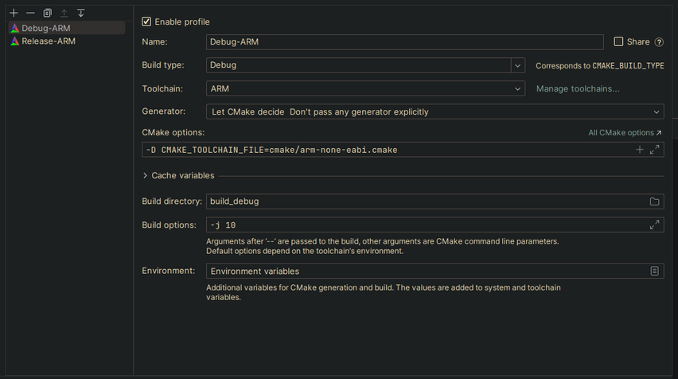

# ARM_bootloader
*ARM bootloader for bare metal embedded projects*  
This project serves as a base for other bare metal projects
#
>## Setup
>1. open the project in clion
>2. configure the ARM toolchain 
>3. configure the run configuration 
> -D CMAKE_TOOLCHAIN_FILE=cmake/arm-none-eabi.cmake